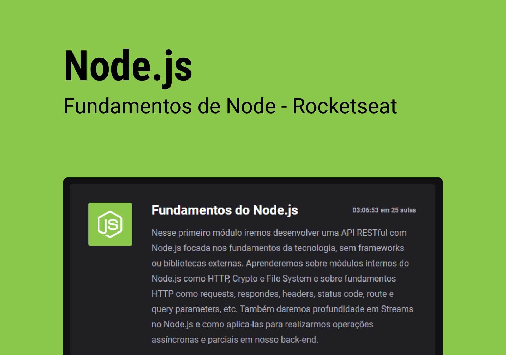

<div align="center">

<h1> Fundamentos de Node.js </h1>
</div>

<p align="center">
Curso da Rocketseat sobre Node.js, iremos desenvolver uma API RESTful com Node.js focada nos fundamentos da tecnologia, sem frameworks ou bibliotecas externas. <br/>
<a href="https://www.rocketseat.com.br/ignite">Saiba mais sobre o Ignite clicando aqui.</a>
</p>

<p align="center">
  <a href="#-tecnologias">Tecnologias</a>&nbsp;&nbsp;&nbsp;|&nbsp;&nbsp;&nbsp;
  <a href="#-projeto">Projeto</a>&nbsp;&nbsp;&nbsp;|&nbsp;&nbsp;&nbsp;
  <a href="#-instalação">Instalação</a>&nbsp;&nbsp;&nbsp;|&nbsp;&nbsp;&nbsp;
  <a href="#memo-licença">Licença</a>&nbsp;&nbsp;&nbsp;|&nbsp;&nbsp;&nbsp;
</p>

<p align="center">
  
</p>

<br>

<p align="center">
  
</p>

## 🚀 Tecnologias

Esse projeto foi desenvolvido com as seguintes tecnologias:

- Javascript
- Node.js
- HTTpie
- Insomnia

## 💻 Projeto

O projeto é uma API RESTful com Node.js focada nos fundamentos da tecnologia, sem frameworks ou bibliotecas externas.


## 🪛 Instalação 

### Pré-requisitos

* npm
```sh
 npm install npm@latest -g
````

### Instalação

1. Clone o repositório
```sh
[https://github.com/florencioMath/Challenge-Ignite-CoffeeDelivery.git](https://github.com/florencioMath/course-ignite-nodejs-fundamentos.git)
```
2. Entre na pasta e instale as dependências
```sh
$ cd course-ignite-nodejs-fundamentos
$ npm install
```
3. Inicie o projeto
```sh
$ npm run dev
```
4. Abra no navegador 
```txt
http://localhost:3333/
```

## :memo: Licença

Esse projeto está sob a licença MIT.

---

Feito com 🖤 by Matheus Florêncio :wave:
